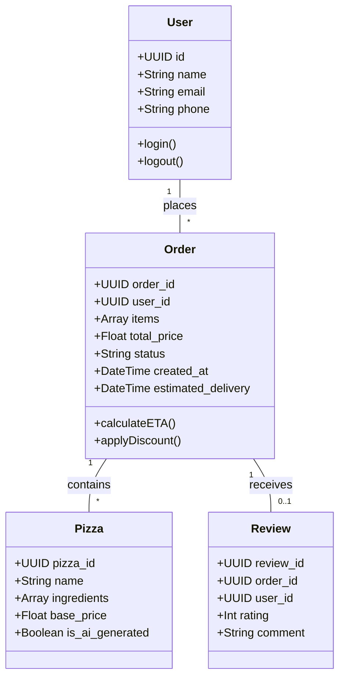
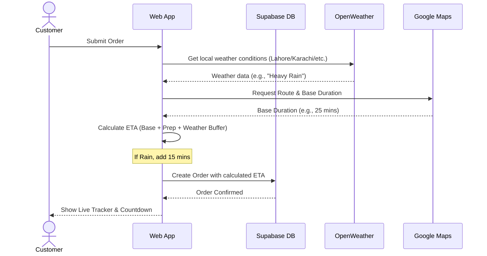

# Taza Pizza SaaS Project Proposal

## Executive Summary
Taza Pizza is transitioning from a traditional static web presence into a fully-fledged software-as-a-service (SaaS) platform. This platform aims to revolutionize the food ordering experience by integrating real-time AI for customized recipes, dynamic delivery tracking, and intelligent localized discount management for the Pakistani market. 

## Objectives
1. **Enhanced User Experience**: Provide an intuitive, visually stunning UI built with modern React.
2. **AI-Powered "Pizza Lab"**: Allow users to generate custom pizza recipes and names dynamically using Large Language Models (LLMs).
3. **Real-time Operations**: Implement live tracking (Google Maps) and weather-adjusted delivery times.
4. **Market Localization**: Introduce automated, dynamic discount events (e.g., Ramadan, Eid).
5. **Data Management**: Maintain robust feedback and order history via a cloud database.

---

## Architecture Diagram (Component & System View)

```mermaid
graph TD
    subgraph Client Application (React / Vite)
        UI[User Interface]
        State[Zustand State Manager]
        Routing[React Router]
        API_Layer[API Service Layer]
    end

    subgraph External APIs & Services
        Supabase[(Supabase - PostgreSQL)]
        Auth[Supabase Auth]
        Maps[Google Maps API]
        Weather[OpenWeather API]
        LLM[Google Gemini API]
    end

    UI --> State
    UI --> Routing
    UI --> API_Layer

    API_Layer -->|Fetch/Save Orders & Reviews| Supabase
    API_Layer -->|Authenticate User| Auth
    API_Layer -->|Calculate Route & ETA| Maps
    API_Layer -->|Check Weather Conditions| Weather
    API_Layer -->|Generate Custom Recipes| LLM
```

---

## Class Diagram (Data Models)



---

## Sequence / Activity Diagram: Smart Delivery Processing



---

## Technical Stack & Justification

- **React 19 + Vite**: Chosen for unparalleled performance, instant HMR during development, and modern features.
- **Tailwind CSS v4 & Radix UI**: Provides a highly customizable, accessible, and premium visual aesthetic matching the required "WOW" factor.
- **Supabase (PostgreSQL)**: An open-source Firebase alternative offering robust relational databases, Row Level Security (RLS), and real-time subscriptions, perfect for order tracking and reviews.
- **Zustand**: A lightweight, fast state-management library for maintaining the shopping cart and user sessions.

## Delivery Timeline
1. **Phase 1: Foundation & Docs** - Architecture, Diagrams, Setup
2. **Phase 2: Core UI** - Home, About, Static Content
3. **Phase 3: AI Integration** - Pizza Lab Development
4. **Phase 4: Backend Integration** - Orders, Reviews, User auth
5. **Phase 5: Real-time features** - Live map tracking, dynamic weather timings
6. **Phase 6: Final Polish** - Animations, Discount engine, Deployment prep.
